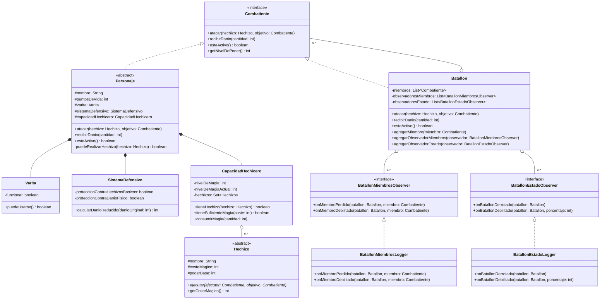

# Sistema de Batalla

```mermaid
classDiagram
    %% Interfaces
    class Combatiente {
        <<interface>>
        +atacar(hechizo: Hechizo, objetivo: Combatiente)
        +recibirDanio(cantidad: int)
        +estaActivo() boolean
        +getNivelDePoder() int
    }

    class BatallonMiembrosObserver {
        <<interface>>
        +onMiembroPerdido(batallon: Batallon, miembro: Combatiente)
        +onMiembroDebilitado(batallon: Batallon, miembro: Combatiente)
    }

    class BatallonEstadoObserver {
        <<interface>>
        +onBatallonDerrotado(batallon: Batallon)
        +onBatallonDebilitado(batallon: Batallon, porcentaje: int)
    }

    %% Clases principales
    class Personaje {
        <<abstract>>
        #nombre: String
        #puntosDeVida: int
        #varita: Varita
        #sistemaDefensivo: SistemaDefensivo
        #capacidadHechicero: CapacidadHechicero
        +atacar(hechizo: Hechizo, objetivo: Combatiente)
        +recibirDanio(cantidad: int)
        +estaActivo() boolean
        -puedeRealizarHechizo(hechizo: Hechizo) boolean
    }

    class Batallon {
        -miembros: List~Combatiente~
        -observadoresMiembros: List~BatallonMiembrosObserver~
        -observadoresEstado: List~BatallonEstadoObserver~
        +atacar(hechizo: Hechizo, objetivo: Combatiente)
        +recibirDanio(cantidad: int)
        +estaActivo() boolean
        +agregarMiembro(miembro: Combatiente)
        +agregarObservadorMiembros(observador: BatallonMiembrosObserver)
        +agregarObservadorEstado(observador: BatallonEstadoObserver)
    }

    %% Observadores concretos
    class BatallonMiembrosLogger {
        +onMiembroPerdido(batallon: Batallon, miembro: Combatiente)
        +onMiembroDebilitado(batallon: Batallon, miembro: Combatiente)
    }

    class BatallonEstadoLogger {
        +onBatallonDerrotado(batallon: Batallon)
        +onBatallonDebilitado(batallon: Batallon, porcentaje: int)
    }

    %% Clases de apoyo
    class Hechizo {
        <<abstract>>
        #nombre: String
        #costeMagico: int
        #poderBase: int
        +ejecutar(ejecutor: Combatiente, objetivo: Combatiente)*
        +getCosteMagico() int
    }

    class CapacidadHechicero {
        -nivelDeMagia: int
        -nivelDeMagiaActual: int
        -hechizos: Set~Hechizo~
        +tieneHechizo(hechizo: Hechizo) boolean
        +tieneSuficienteMagia(coste: int) boolean
        +consumirMagia(cantidad: int)
    }

    class SistemaDefensivo {
        -proteccionContraHechizosBasicos: boolean
        -proteccionContraDanioFisico: boolean
        +calcularDanioReducido(danioOriginal: int) int
    }

    class Varita {
        -funcional: boolean
        +puedeUsarse() boolean
    }

    %% Relaciones
    Combatiente <|.. Personaje
    Combatiente <|.. Batallon
    Batallon o-- "0..*" Combatiente
    Batallon o-- "0..*" BatallonMiembrosObserver
    Batallon o-- "0..*" BatallonEstadoObserver
    BatallonMiembrosObserver <|.. BatallonMiembrosLogger
    BatallonEstadoObserver <|.. BatallonEstadoLogger
    Personaje *-- Varita
    Personaje *-- SistemaDefensivo
    Personaje *-- CapacidadHechicero
    CapacidadHechicero o-- "0..*" Hechizo

```