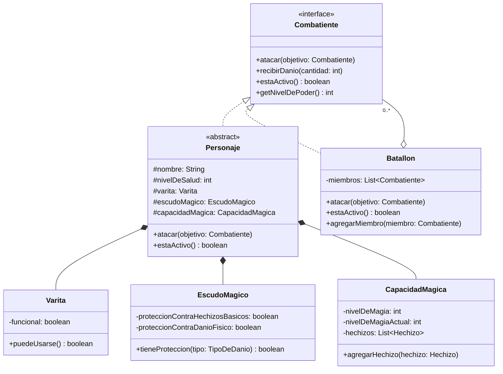

# Sistema de Batalla

```mermaid
classDiagram
    class Combatiente {
        <<interface>>
        +atacar(objetivo: Combatiente)
        +recibirDanio(cantidad: int)
        +estaActivo() boolean
        +getNivelDePoder() int
    }
    
    class Personaje {
        <<abstract>>
        #nombre: String
        #nivelDeSalud: int
        #varita: Varita
        #escudoMagico: EscudoMagico
        #capacidadMagica: CapacidadMagica
        +atacar(objetivo: Combatiente)
        +estaActivo() boolean
    }
    
    class Batallon {
        -miembros: List~Combatiente~
        +atacar(objetivo: Combatiente)
        +estaActivo() boolean
        +agregarMiembro(miembro: Combatiente)
    }
    
    class EscudoMagico {
        -proteccionContraHechizosBasicos: boolean
        -proteccionContraDanioFisico: boolean
        +tieneProteccion(tipo: TipoDeDanio) boolean
    }
    
    class CapacidadMagica {
        -nivelDeMagia: int
        -nivelDeMagiaActual: int
        -hechizos: List~Hechizo~
        +agregarHechizo(hechizo: Hechizo)
    }
    
    class Varita {
        -funcional: boolean
        +puedeUsarse() boolean
    }
    
    Combatiente <|.. Personaje
    Combatiente <|.. Batallon
    Batallon o-- "0..*" Combatiente
    Personaje *-- Varita
    Personaje *-- EscudoMagico
    Personaje *-- CapacidadMagica
```