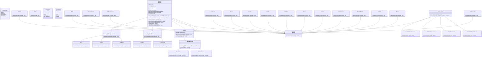

# Sistema de Batalla Original

```mermaid
classDiagram

%% Enumeración TipoPersonaje
class TipoPersonaje {
    <<enumeration>>
    AUROR
    PROFESOR
    ESTUDIANTE
    SEGUIDOR
    COMANDANTE
}

%% Clase abstracta Personaje y sus atributos y métodos
class Personaje {
    <<abstract>>
    - nombre: String
    - nivelDeMagia: int
    - nivelDeMagiaActual: int
    - puntosDeVida: int
    - puntosDeVidaActual: int
    - hechizos: List~Hechizo~
    - proteccionContraHechizosBasicos: boolean
    - proteccionContraDanioFisico: boolean
    - tieneVarita: boolean
    + lanzarHechizo(hechizo: Hechizo, personaje: Personaje): void
    + setProteccionContraHechizosBasicos(valor: boolean): void
    + setProteccionContraDanioFisico(valor: boolean): void
    + setTieneVarita(valor: boolean): void
    + setHechizos(hechizos: List~Hechizo~): void
    + getProteccionContraHechizosBasicos(): boolean
    + getProteccionContraDanioFisico(): boolean
    + getTieneVarita(): boolean
    + getHechizos(): List~Hechizo~
    + agregarHechizo(hechizo: Hechizo): void
}

%% Clase Mago y subclases
class Mago {
    # PUNTOS_DE_VIDA_INICIAL = 5
    # NIVEL_DE_MAGIA_INICIAL = 10
    + lanzarHechizo(personaje: Personaje): void
}

class Auror {
    + lanzarHechizo(personaje: Personaje): void
}

class Profesor {
    + lanzarHechizo(personaje: Personaje): void
}

class Estudiante {
    + lanzarHechizo(personaje: Personaje): void
}

%% Clase Mortifago y subclases
class Mortifago {
    # PUNTOS_DE_VIDA_INICIAL = 10
    # NIVEL_DE_MAGIA_INICIAL = 10
    + lanzarHechizo(personaje: Personaje): void
}

class Seguidor {
    + lanzarHechizo(personaje: Personaje): void
}

class Comandante {
    + lanzarHechizo(personaje: Personaje): void
}

Personaje <|-- Mago
Mago <|-- Auror
Mago <|-- Profesor
Mago <|-- Estudiante

Personaje <|-- Mortifago
Mortifago <|-- Seguidor
Mortifago <|-- Comandante

%% Clase Batallon
class Batallon {
    - personajes: List~Personaje~
    + agregarPersonaje(personaje: Personaje): void
    + tienePersonajesSaludables(): boolean
    + atacar(batallon: Batallon): void
}

Personaje --> Batallon

%% Nota
%%note right of Batallon : En el método atacar, usará Prolog para decidir qué personaje del batallón lanzará un hechizo, el hechizo en cuestión y a quién aplicará.

%% Clase PersonajeFactory y sus subclases
class PersonajeFactory {
    + crearPersonaje(tipo: TipoPersonaje): Personaje
    + crearMago(): Personaje
    + crearMortifago(): Personaje
}

class MagoFactory {
    + crearPersonaje(tipo: TipoPersonaje): Personaje
}

class MortifagoFactory {
    + crearPersonaje(tipo: TipoPersonaje): Personaje
}

PersonajeFactory --> Personaje
PersonajeFactory <|-- MagoFactory
PersonajeFactory <|-- MortifagoFactory

%% Clase Main
class Main {
    + main(String args[]): void
}

Batallon --> PersonajeFactory
Batallon o-- "0..*" Personaje

%% Enumeración Nivel y TipoDeMagia
class Nivel {
    <<enumeration>>
    PRINCIPIANTE
    MEDIO
    AVANZADA
    MUY_AVANZADA
}

class TipoDeMagia {
    <<enumeration>>
    DEFENSA
    ATAQUE
    OSCURA
    ESPECIAL
}

%% Interfaz Hechizo
class Hechizo {
    <<interface>>
    + ejecutar(personaje: Personaje): String
}

%% Clase abstracta HechizoFactory y sus subclases
class HechizoFactory {
    + crearHechizo(nivel: Nivel): Hechizo
    + crearHechizo(tipo: TipoDeMagia, nivel: Nivel): Hechizo
}

class HechizosDefensivosFactory {
    + crearHechizo(nivel: Nivel): Hechizo
}

class HechizosAtaqueFactory {
    + crearHechizo(nivel: Nivel): Hechizo
}

class AtaqueOscuroFactory {
    + crearHechizo(nivel: Nivel): Hechizo
}

class HabilidadesEspecialFactory {
    + crearHechizo(nivel: Nivel): Hechizo
}


HechizoFactory --> Hechizo

HechizoFactory <|-- HechizosDefensivosFactory
HechizoFactory <|-- HechizosAtaqueFactory
HechizoFactory <|-- AtaqueOscuroFactory
HechizoFactory <|-- HabilidadesEspecialFactory

%% Clases de hechizos defensivos
class Protego {
    + ejecutar(personaje: Personaje): void
}

class Abalio {
    + ejecutar(personaje: Personaje): void
}

class CrassoArmorum {
    + ejecutar(personaje: Personaje): void
}

class VulnerasSanentur {
    + ejecutar(personaje: Personaje): void
}

Protego --|> Hechizo
Abalio --|> Hechizo
CrassoArmorum --|> Hechizo
VulnerasSanentur --|> Hechizo

%% Clases de hechizos de ataque
class Expelliarmus {
    + ejecutar(personaje: Personaje): void
}

class Desmaius {
    + ejecutar(personaje: Personaje): void
}

class Incendio {
    + ejecutar(personaje: Personaje): void
}

class Expulso {
    + ejecutar(personaje: Personaje): void
}

Expelliarmus --|> Hechizo
Desmaius --|> Hechizo
Incendio --|> Hechizo
Expulso --|> Hechizo

%% Clases de hechizos oscuros
class Confringo {
    + ejecutar(personaje: Personaje): void
}

class Crucio {
    + ejecutar(personaje: Personaje): void
}

class Imperius {
    + ejecutar(personaje: Personaje): void
}

class AvadaKedavra {
    + ejecutar(personaje: Personaje): void
}

Confringo --|> Hechizo
Crucio --|> Hechizo
Imperius --|> Hechizo
AvadaKedavra --|> Hechizo

%% Clases de habilidades especiales
class ProtegoDiabolica {
    + ejecutar(personaje: Personaje): void
}

class Embrujo {
    + ejecutar(personaje: Personaje): void
}

class Inferius {
    + ejecutar(personaje: Personaje): void
}

class SectumSempra {
    + ejecutar(personaje: Personaje): void
}

ProtegoDiabolica --|> Hechizo
Embrujo --|> Hechizo
Inferius --|> Hechizo
SectumSempra --|> Hechizo

%% Descripción del método de creación en las fábricas
%%note right of HechizosDefensivosFactory : switch(nivelDeDificultad) { \n PRINCIPIANTE -> Protego();\n MEDIO -> ProtegoDuo();\n AVANZADA -> ProtegoHorbilis();\n MUY_AVANZADA -> Abalio(); }
%%note right of HechizosAtaqueFactory : switch(nivelDeDificultad) { \n PRINCIPIANTE -> Expelliarmus();\n MEDIO -> Desmaius();\n AVANZADA -> Incendio();\n MUY_AVANZADA -> Expulso(); }
%%note right of AtaqueOscuroFactory : switch(nivelDeDificultad) { \n PRINCIPIANTE -> Confringo();\n MEDIO -> Crucio();\n AVANZADA -> Imperius();\n MUY_AVANZADA -> AvadaKedavra(); }
%%note right of HabilidadesEspecialFactory : switch(nivelDeDificultad) { \n PRINCIPIANTE -> ProtegoDiabolica();\n MEDIO -> Embrujo();\n AVANZADA -> Inferius();\n MUY_AVANZADA -> SectumSempra(); }


Personaje o-- "0..*" Hechizo
```